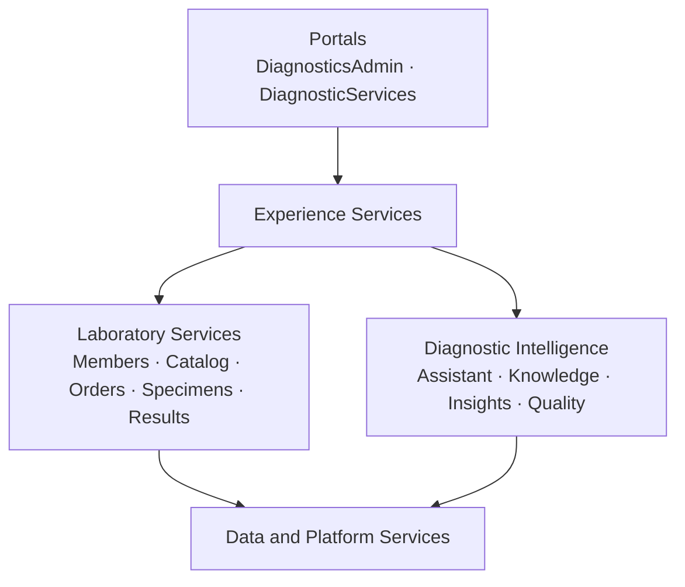

# Diagnostic Intelligence Platform

A healthcare digital diagnostics platform that helps members access laboratory services while enabling operations teams to manage orders, specimens, results, exceptions, and service insights.

> **Project status: Planning and architecture.** The repository is being implemented incrementally. Capabilities described as planned are not yet available.

## Overview

The Diagnostic Intelligence Platform is a vendor-neutral, portfolio-grade application for exploring modern laboratory-service workflows. It combines conventional healthcare application capabilities with a carefully bounded intelligent assistant.

The platform is designed around two experiences:

- **DiagnosticServices** gives synthetic healthcare members access to laboratory orders, specimen progress, released results, and grounded plain-language explanations.
- **DiagnosticsAdmin** helps authorized operations users search and investigate orders and specimens, manage the synthetic test catalog and knowledge base, review exceptions, evaluate assistant quality, and observe platform health.

All people, orders, specimens, results, and operational records in this project are synthetic. The platform is for software engineering, architecture, and AI-system learning—not real clinical use.

## Why This Project Exists

Laboratory information is usually distributed across customer records, test catalogs, orders, specimens, results, operational events, and procedural documentation. Customers need a simple view of their laboratory services, while operations teams need a traceable way to reconstruct what happened and identify delays or exceptions.

This project demonstrates how those capabilities can be designed as a modern platform with:

- Business-capability-aligned services.
- Customer and operations web experiences.
- Reproducible synthetic healthcare and laboratory data.
- Deterministic order, specimen, result, and exception processing.
- Grounded knowledge retrieval with traceable citations.
- Bounded, read-only assistant tool orchestration.
- Streaming responses with deterministic event ordering.
- Software and AI-specific quality evaluation.
- Local container orchestration and an incremental AWS delivery path.

## Product Principles

1. **Business capabilities before technical components.** Top-level repository areas describe what the platform provides, while technologies such as RAG, embeddings, pgvector, and vLLM remain implementation details.
2. **Deterministic facts before generated explanations.** Orders, specimen states, results, authorization, and timestamps always come from authoritative application services.
3. **Evidence before conclusions.** Assistant responses must cite structured records or approved knowledge sources and state when evidence is incomplete.
4. **Synthetic data only.** Real patient, employer, or proprietary laboratory information is prohibited.
5. **Incremental delivery.** The platform grows through small, tested vertical slices rather than generating every planned microservice at once.
6. **Replaceable model infrastructure.** Applications access models through an internal OpenAI-compatible abstraction rather than depending directly on one provider.
7. **Quality and observability are product capabilities.** Testing, evaluation, tracing, metrics, and auditability are developed with each feature.

## Planned Experiences

### DiagnosticServices

The member-facing experience is planned to include:

- Secure access to a synthetic member profile.
- Laboratory order history and order details.
- Specimen status and chronological processing timeline.
- Released synthetic laboratory results.
- Plain-language, non-diagnostic result information.
- A grounded assistant limited to the member's authorized records and approved educational knowledge.

### DiagnosticsAdmin

The internal operations experience is planned to include:

- Operational dashboards.
- Search by member, order, specimen, test, or correlation identifier.
- End-to-end order and specimen investigation.
- Deterministic delay and exception identification.
- Test-catalog and reference-data management.
- Knowledge-source ingestion, validation, publication, and retirement.
- Synthetic dataset generation and validation.
- Assistant evaluation and configuration comparison.
- Platform health and observability access.

## Architecture at a Glance



Portals communicate through their corresponding experience APIs. Business services own authoritative laboratory records. Diagnostic Intelligence uses approved read-only tools and published knowledge; it does not directly mutate systems of record.

## Repository Organization

The target monorepo is organized by business responsibility:

```text
diagnostic-intelligence-platform/
├── README.md
├── PRD.md
├── CLAUDE.md
├── REQUIREMENTS-ARCHITECTURE.md
├── LOCAL-DEVELOPMENT.md
├── SECURITY.md
├── Portals/
│   ├── DiagnosticsAdmin/
│   └── DiagnosticServices/
├── Middleware/
│   ├── ExperienceServices/
│   ├── LaboratoryServices/
│   ├── DiagnosticIntelligence/
│   └── SharedServices/
├── DataMgmt/
│   ├── SyntheticDataGen/
│   ├── ReferenceData/
│   ├── DataIngestion/
│   ├── KnowledgeData/
│   └── Database/
├── DevOps/
│   ├── Local/
│   ├── Containers/
│   ├── Terraform/
│   └── AWS/
├── Testing/
└── Docs/
    ├── Architecture/
    ├── ADR/
    ├── DataModel/
    ├── ThreatModels/
    ├── Runbooks/
    └── Execution/
```

This tree represents the destination. Unimplemented capabilities should not be scaffolded as empty deployable services simply to reproduce it.

## Business Capabilities

| Capability | Responsibility |
|---|---|
| `ExperienceServices` | Portal-specific composition, authorization, response shaping, and assistant streaming |
| `CustomerServices` | Synthetic member identity and profile projections |
| `TestCatalogServices` | Versioned project test definitions and terminology mappings |
| `LabOrderServices` | Laboratory orders, ordered tests, state, and order events |
| `SpecimenServices` | Specimens, lifecycle state, timelines, and specimen events |
| `ResultServices` | Synthetic laboratory results, panels, flags, release, and correction history |
| `AssistantServices` | Bounded conversations, approved tools, model access, safety, and streaming |
| `KnowledgeServices` | Documents, versions, chunking, embeddings, retrieval, and citations |
| `InsightsServices` | Deterministic delays, exceptions, turnaround insights, and operational summaries |
| `QualityServices` | Retrieval, answer, tool-use, safety, latency, and regression evaluation |

The initial implementation may combine related capabilities into fewer modular deployables. Capability and data-ownership boundaries must still be preserved.

## Data Strategy

The platform uses only approved public standards, appropriately licensed reference sources, and project-owned synthetic data.

| Data need | Planned source |
|---|---|
| Synthetic people and clinical records | Synthea FHIR R4 |
| Laboratory terminology | LOINC |
| Test catalog | Project-authored synthetic catalog mapped to LOINC |
| Orders, specimens, events, and results | Reproducible project synthetic-data generator |
| Operational procedures | Project-authored synthetic SOPs |
| Educational knowledge | Approved public or properly licensed references with provenance |

Project test identifiers use original codes such as `LAB-10001`. The project does not copy a commercial laboratory's identifiers, catalog, proprietary documents, or internal workflows.

## Intelligence Boundary

The intelligent assistant is an explanation and investigation capability—not a diagnosis engine.

It may:

- Retrieve published knowledge.
- Read authorized order, specimen, result, and catalog facts through approved tools.
- Summarize evidence.
- Explain operational delays.
- Provide citations and state uncertainty.

It may not:

- Diagnose a condition or recommend treatment.
- Access another member's records.
- Invent missing operational or clinical facts.
- Execute arbitrary HTTP, SQL, shell, or filesystem operations.
- Directly create or change authoritative laboratory records.
- Treat model output as a system of record.

## Technology Direction

Final versions and material choices will be pinned through Architecture Decision Records before implementation.

| Area | Planned baseline |
|---|---|
| Business services | Java and Spring Boot |
| Web experiences | Angular and TypeScript |
| Intelligence and data processing | Python where independently justified |
| Primary and vector storage | PostgreSQL with pgvector initially |
| Identity for local development | Keycloak with OAuth 2.0/OIDC |
| Model serving | vLLM through an OpenAI-compatible model-access layer |
| API contracts | OpenAPI 3.1 |
| Database migrations | Version-controlled migrations, initially Flyway for Java-owned schemas |
| Observability | OpenTelemetry, Prometheus, Grafana, and structured logs |
| Local runtime | Docker and Docker Compose |
| CI/CD | GitHub Actions |
| Cloud infrastructure | Terraform and AWS |

Redis, Kafka, Kubernetes, and a separate vector database are not initial defaults. They will be introduced only when an accepted requirement and architecture decision justify them.

## Delivery Roadmap

| Phase | Focus | Status |
|---|---|---|
| Milestone 0 | Architecture decisions, repository foundation, conventions, CI, local PostgreSQL, and identity | Planned |
| Phase 1 | Synthetic catalog, orders, specimens, timelines, delay rules, and initial portals | Planned |
| Phase 2 | Members, Synthea/LOINC ingestion, results, knowledge lifecycle, retrieval, and citations | Planned |
| Phase 3 | Bounded assistant tools, deterministic streaming, quality evaluation, and full observability | Planned |
| Phase 4 | Terraform, AWS deployment, performance, resilience, security, cost controls, and LLMOps | Planned |

The roadmap describes sequencing rather than a promise that every target component already exists.

## Getting Started

Application code has not yet been generated. The first implementation activity is Milestone 0 planning and architecture decisions.

### Planning with Claude Code

Place `PRD.md`, `CLAUDE.md`, and this README at the repository root, then start Claude Code:

```bash
cd diagnostic-intelligence-platform
claude
```

Start in Plan Mode and use:

```text
Read CLAUDE.md and PRD.md completely. Inspect the repository and git status
without generating application code. In Plan Mode, create a proposed Milestone 0
work-package plan that maps tasks to PRD requirement IDs, recommends the smallest
initial deployable boundaries, identifies required ADRs and owner decisions, and
defines verification commands. Wait for my approval before creating files.
```

`CLAUDE.md` contains the complete long-running-agent operating model, checkpoint protocol, architectural guardrails, and handoff format.

### Planned local-development interface

When the corresponding milestone is implemented, local infrastructure will be operated through:

```bash
./DevOps/Local/docker-all-up.sh
./DevOps/Local/docker-all-status.sh
./DevOps/Local/docker-all-logs.sh
./DevOps/Local/docker-all-down.sh
```

These commands are planned contracts and should not be expected to work until their milestone is marked implemented. `LOCAL-DEVELOPMENT.md` will become the authoritative setup and troubleshooting guide.

## Documentation Map

| Document | Purpose |
|---|---|
| `README.md` | Project introduction, current status, and navigation |
| `PRD.md` | Product scope, users, requirements, safety boundaries, phases, and acceptance criteria |
| `CLAUDE.md` | Instructions for long-running Claude Code planning and implementation sessions |
| `REQUIREMENTS-ARCHITECTURE.md` | Detailed architecture, service boundaries, data flows, deployment views, and quality attributes |
| `LOCAL-DEVELOPMENT.md` | Local prerequisites, startup, verification, troubleshooting, and shutdown |
| `SECURITY.md` | Security policy, threat boundaries, vulnerability handling, and responsible-AI controls |
| `Docs/ADR/` | Accepted material architecture and technology decisions |
| `Docs/Execution/` | Durable roadmap, current work, decision queue, risks, and resumable session state |

## Current Status

The product definition and Claude Code operating model are complete. Application scaffolding and technology-version selection have intentionally not started.

The next approved activity should be:

1. Establish Milestone 0 work packages.
2. Decide the smallest initial deployable boundaries.
3. Create the required foundational ADRs.
4. Select and pin supported framework versions.
5. Implement one deterministic vertical slice before introducing model infrastructure.

## Responsible Use

This repository is an educational and portfolio project. It is not a medical device, clinical decision-support system, diagnostic service, or production healthcare application. It must not be used with real patient data or for medical decisions.

Any generated explanation must be treated as demonstration output. Medical interpretation belongs to qualified healthcare professionals.

## Attribution and Independence

This is an independent, vendor-neutral project inspired by general laboratory-services workflows and public healthcare interoperability standards. It is not affiliated with, endorsed by, or derived from the proprietary systems of Quest Diagnostics or any other healthcare organization.

## Contributing

Contribution instructions will be defined during Milestone 0. Until then:

- Read `PRD.md` and `CLAUDE.md` before proposing implementation.
- Map changes to stable PRD requirement IDs.
- Use synthetic data only.
- Preserve business capability and data-ownership boundaries.
- Propose one bounded, verifiable work package at a time.
- Do not introduce new runtime technologies without an accepted requirement and ADR.

## License

The repository license has not yet been selected. Do not add a license file or assume redistribution terms until the owner accepts the relevant ADR or repository decision.

