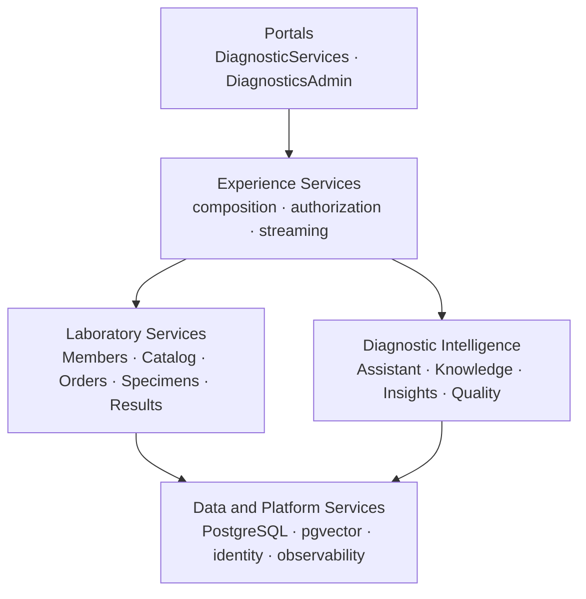

# Diagnostic Intelligence Platform

**A healthcare digital diagnostics platform that helps members access laboratory services while enabling operations teams to manage orders, specimens, results, exceptions, and service insights.**

Built to production engineering standards — capability-owned data, versioned contracts, migrations, observability, security review, and CI from the first slice — and run entirely on synthetic data.

> **Project status: planning and architecture.** The platform is being implemented incrementally. Anything described below as *planned* does not exist yet. See [Current status](#current-status).

> **Synthetic data, non-clinical.** Every person, order, specimen, and result is generated. The platform is not cleared or intended for clinical use, makes no diagnostic or treatment recommendation, and claims no HIPAA compliance, CLIA certification, or FDA clearance. It is vendor-neutral and derived from no real laboratory company's systems, data, or documents.

---

## The problem

A diagnostic laboratory runs on a simple promise: a sample is collected, it moves through the lab, and a trustworthy result comes back on time. The value is created — and lost — in the gap between those events.

Two things go wrong in that gap.

**Members are left in the dark.** An order is placed and then goes quiet. Where is my sample? Is something wrong? Is the result ready? Absent an answer, people call — and each call can cost more than the test.

**Operations teams work blind across systems.** When a specimen stalls, the answer lives in fragments: order state in one system, specimen custody in another, an exception code in a third, and the actual procedure buried in a document nobody can find quickly. Investigating one delayed specimen means assembling that story by hand, hundreds of times a day.

This platform closes both gaps. It gives members a clear, honest view of their own diagnostic journey, and it gives operations a single place to see the whole picture — with an assistant that assembles the evidence and cites the procedure, turning a five-minute investigation into a five-second one.

Laboratory information is normally spread across member records, test catalogs, orders, specimens, results, operational events, and procedural documentation. Bringing that together as one platform is what this project builds:

- Business-capability-aligned services with clear data ownership.
- Member and operations web experiences.
- Reproducible synthetic healthcare and laboratory data.
- Deterministic order, specimen, result, and exception processing.
- Grounded knowledge retrieval with traceable citations.
- Bounded, read-only assistant tool orchestration.
- Streaming responses with deterministic event ordering.
- Software and AI-specific quality evaluation.
- Local container orchestration and an incremental AWS delivery path.

---

## What the platform delivers

### DiagnosticServices — the member experience

The diagnostic journey, made visible:

- Secure access to a member profile.
- Laboratory order history and order detail.
- Specimen status and a chronological processing timeline.
- Released results with reference ranges, units, and flags.
- Plain-language, explicitly non-diagnostic result information.
- An assistant limited to that member's authorized records and approved knowledge.

### DiagnosticsAdmin — the operations experience

Investigation, not archaeology:

- Operational dashboards for the working queue.
- Search by member, order, specimen, test, or correlation identifier.
- End-to-end order and specimen investigation in one view.
- Deterministic delay and exception identification.
- Test-catalog and reference-data management.
- Knowledge-source ingestion, validation, publication, and retirement.
- Synthetic dataset generation and validation.
- Assistant evaluation and configuration comparison.
- Platform health and observability access.

### The assistant — answers that show their work

Ask *why is this specimen delayed, and what does the procedure say to do next?* and get an answer combining live operational facts with the cited section of the relevant standard operating procedure.

Every answer traces back to the exact tool results and document version that produced it. That traceability is the point: an operations team can act on the answer without being asked to trust a black box.

---

## Product principles

1. **Business capabilities before technical components.** Top-level areas describe what the platform provides; RAG, embeddings, pgvector, and vLLM stay implementation details beneath them.
2. **Deterministic facts before generated explanations.** Orders, specimen states, results, authorization, and timestamps always come from authoritative services.
3. **Evidence before conclusions.** Responses cite structured records or approved knowledge, and state plainly when evidence is incomplete.
4. **Synthetic data only.** Real patient, employer, or proprietary laboratory information is prohibited.
5. **Incremental delivery.** The platform grows through small, tested vertical slices — never by generating every planned service at once.
6. **Replaceable model infrastructure.** Applications reach models through an internal OpenAI-compatible abstraction, not a direct dependency on one provider.
7. **Quality and observability are product capabilities.** Testing, evaluation, tracing, metrics, and auditability ship with each feature, not after.

---

## Architecture at a glance



Three rules keep this honest as it grows:

1. **Portals stay behind their experience API.** Each portal talks to exactly one experience service, which composes from business capabilities. A portal never calls a laboratory service directly.
2. **Every capability owns its data.** Local development runs a single PostgreSQL instance, but each capability owns a logical schema (`lab_order`, `specimen`, `result`, `catalog`, `customer`, `knowledge`, `assistant`, `quality`) and no service reads another's tables. Integration goes through versioned APIs, events, or deliberately owned read models.
3. **Business language at the boundary.** Folders and services are named for what they do for the business (`KnowledgeServices`), not how they are built (`RagService`).

### Business capabilities

| Capability | Responsibility |
|---|---|
| `ExperienceServices` | Portal-specific composition, authorization, response shaping, assistant streaming |
| `CustomerServices` | Synthetic member identity and profile projections |
| `TestCatalogServices` | Versioned test definitions and terminology mappings |
| `LabOrderServices` | Laboratory orders, ordered tests, order state, order events |
| `SpecimenServices` | Specimens, lifecycle state, timelines, specimen events |
| `ResultServices` | Results, panels, flags, release, and correction history |
| `AssistantServices` | Bounded conversations, approved tools, model access, safety, streaming |
| `KnowledgeServices` | Documents, versions, chunking, embeddings, retrieval, citations |
| `InsightsServices` | Deterministic delays, exceptions, turnaround insights, operational summaries |
| `QualityServices` | Retrieval, answer, tool-use, safety, latency, and regression evaluation |

The capability map is the target shape, not the day-one deployable count. Early milestones combine related capabilities into a few modular applications while preserving module and data-ownership boundaries, so they can be extracted later.

---

## The intelligence boundary

The assistant is an explanation and investigation capability — not a diagnosis engine. The constraint is the product, and it is enforced in the services rather than requested in a prompt.

**It may:**

- Retrieve published knowledge.
- Read authorized order, specimen, result, and catalog facts through approved tools.
- Summarize evidence and explain operational delays.
- Provide citations and state uncertainty.

**It may not:**

- Diagnose a condition or recommend treatment.
- Access another member's records.
- Invent missing operational or clinical facts.
- Execute arbitrary HTTP, SQL, shell, or filesystem operations.
- Directly create or change authoritative laboratory records.
- Be treated as a system of record.

Tools are allowlisted, schema-validated, bounded, and read-only. Where evidence is missing or conflicting, the assistant returns an explicit limitation rather than a plausible invention.

---

## The data

Everything the platform runs on is synthetic, reproducible, and openly sourced — the provenance story is part of the product.

| Data need | Source | Policy |
|---|---|---|
| Synthetic people and clinical records | Synthea FHIR R4 | Generator version pinned, provenance recorded |
| Laboratory terminology | LOINC | Used under license, release version recorded, required subsets only |
| Test catalog | Project-authored, mapped to LOINC | Original codes such as `LAB-10001` |
| Orders, specimens, events, results | Project synthetic-data generator | Deterministic and repeatable at configurable volumes |
| Operational procedures | Project-authored synthetic SOPs | Clearly labeled as synthetic |
| Domain context | Approved public or licensed references | Source and terms metadata stored, no bulk scraping |

Real patient data, protected health information, prior-employer material, proprietary laboratory documents, and bulk-scraped commercial content are prohibited — enforced in review, not merely preferred. The project copies no commercial laboratory's identifiers, catalog, documents, or internal workflows.

The model follows the shape of the real domain: a **member** places a **laboratory order** for one or more **tests**; a **specimen** is collected against that order and moves through custody and processing; **results** are produced, validated, and released; and every meaningful transition emits an immutable **operational event**. Delays and exceptions are *derived* from that authoritative state and versioned rules — computed facts, never model opinions.

---

## Technology

Production-style choices, each made for a reason. Final versions are pinned through Architecture Decision Records before implementation.

| Area | Baseline |
|---|---|
| Business services | Java 21+ LTS, Spring Boot 3.x |
| Web experiences | Angular and TypeScript, single workspace |
| Intelligence and data processing | Python, where independently justified |
| Primary and vector storage | PostgreSQL with pgvector |
| Identity | Keycloak with OAuth 2.0 / OIDC locally, replaceable in cloud |
| Model serving | vLLM through an OpenAI-compatible model-access layer |
| API contracts | OpenAPI 3.1 with RFC 9457 problem details |
| Database migrations | Versioned migrations, Flyway for Java-owned schemas |
| Observability | OpenTelemetry, Prometheus, Grafana, structured logs |
| Local runtime | Docker and Docker Compose |
| CI/CD | GitHub Actions |
| Cloud infrastructure | Terraform and AWS |

**Serving the model.** **vLLM** hosts the open-weight generative model behind an **OpenAI-compatible endpoint**. Continuous batching and paged attention are what make concurrent streaming responses viable on a single GPU, and the project measures that claim directly: a plain Hugging Face inference baseline is benchmarked separately, then compared against vLLM on time-to-first-token, inter-token latency, output tokens per second, and throughput under concurrency.

**Keeping the model replaceable.** Every service reaches the model through an internal OpenAI-compatible abstraction. vLLM is the initial runtime; OpenAI, Azure OpenAI, or Amazon Bedrock can replace it through an adapter without touching a portal API or any laboratory domain logic. Model, prompt, retrieval, and safety-policy versions are recorded with every execution.

**Grounding the answers.** **pgvector** provides vector search inside the primary PostgreSQL instance, so retrieval works without operating a separate vector store on day one. Documents are versioned, parsed, chunked, and embedded; retrieval runs only against published knowledge versions and preserves source, document version, section, chunk ID, and score, so every citation is real and traceable. Responses stream over Server-Sent Events with ordered, monotonic sequence numbers, and correlation identifiers propagate across every request path.

**Deliberately absent.** Redis, Kafka, Kubernetes, and a standalone vector database are not initial defaults. Each is a real tool with a real operational cost, and each is introduced only when a documented requirement and an accepted decision record justify it. Restraint here is a design goal, not an oversight.

---

## Repository organization

The target monorepo is organized by business responsibility:

```text
diagnostic-intelligence-platform/
├── README.md
├── PRD.md                          Product requirements — the source of truth
├── CLAUDE.md                       Operating guide for coding agents
├── REQUIREMENTS-ARCHITECTURE.md    Architecture constraints and views
├── LOCAL-DEVELOPMENT.md            Setup, ports, profiles, troubleshooting
├── SECURITY.md                     Security posture and reporting
│
├── Portals/                        The two user experiences
│   ├── DiagnosticServices/           Member portal
│   ├── DiagnosticsAdmin/             Operations portal
│   └── SharedExperience/             Shared UI library
│
├── Middleware/
│   ├── ExperienceServices/         Composition and authorization, one per portal
│   ├── LaboratoryServices/         Systems of record — members, catalog, orders,
│   │                                 specimens, results, notifications
│   ├── DiagnosticIntelligence/     Assistant, knowledge and retrieval,
│   │                                 operational insights, evaluation quality
│   └── SharedServices/             Cross-cutting contracts and conventions only
│
├── DataMgmt/
│   ├── SyntheticDataGen/           Reproducible people, orders, specimens, results
│   ├── ReferenceData/              LOINC, units, value sets
│   ├── DataIngestion/              Synthea and reference-data pipelines
│   ├── KnowledgeData/              Synthetic SOPs, public references, eval corpus
│   └── Database/                   Schemas, migrations, seed data
│
├── DevOps/
│   ├── Local/                      One-command local stack and compose profiles
│   ├── Containers/  Terraform/  AWS/
│
├── Testing/                        Functional, Integration, Contract, EndToEnd,
│                                   Performance, Security, Resilience,
│                                   IntelligenceQuality
└── Docs/
    ├── Architecture/  ADR/  API/  DataModel/  ThreatModels/  Runbooks/
    └── Execution/                  Durable work state for long-running agents
```

This tree is the destination. Unimplemented capabilities are not scaffolded as empty deployable services to reproduce it — a capability folder carries a short boundary README until its milestone begins.

---

## Delivery roadmap

| Phase | Focus | Status |
|---|---|---|
| **Milestone 0** | Architecture decisions, repository foundation, conventions, CI, local PostgreSQL and identity | Planned |
| **Phase 1 — Deterministic foundation** | Synthetic catalog, orders, specimens, timelines, delay rules, both portals and their experience APIs, contracts, migrations, observability baseline | Planned |
| **Phase 2 — Results and grounded knowledge** | Members, Synthea and LOINC ingestion, results, knowledge lifecycle, pgvector retrieval with citations, evaluation baseline | Planned |
| **Phase 3 — Tool-assisted intelligence** | Bounded read-only assistant tools, evidence-backed delay investigation, deterministic streaming, quality evaluation, full traces | Planned |
| **Phase 4 — Cloud and LLMOps** | Terraform, AWS delivery, performance, resilience, security, cost controls, evaluation gates and dashboards | Planned |

The roadmap describes sequencing, not a promise that any target component already exists. Phase 1 is deliberately useful *without* generative AI — the intelligence layer augments a platform that already works on its own.

---

## Current status

The product definition and the agent operating model are complete. Application scaffolding and technology-version selection have intentionally not started.

The next approved activities are:

1. Establish Milestone 0 work packages.
2. Decide the smallest initial deployable boundaries.
3. Create the required foundational ADRs.
4. Select and pin supported framework versions.
5. Implement one deterministic vertical slice before introducing model infrastructure.

---

## Getting started

Application code has not been generated yet. The first implementation activity is Milestone 0 planning and architecture decisions.

### Planning with Claude Code

With `PRD.md` and `CLAUDE.md` at the repository root:

```bash
cd diagnostic-intelligence-platform
claude
```

Start in Plan Mode and use:

```text
Read CLAUDE.md and PRD.md completely. Inspect the repository and git status
without generating application code. In Plan Mode, create a proposed Milestone 0
work-package plan that maps tasks to PRD requirement IDs, recommends the smallest
initial deployable boundaries, identifies required ADRs and owner decisions, and
defines verification commands. Wait for my approval before creating files.
```

`CLAUDE.md` carries the full long-running-agent operating model: work-package lifecycle, durable execution state, checkpoint protocol, architectural guardrails, security checklist, and handoff format.

The [`superpowers`](https://github.com/obra/superpowers) plugin is enabled for this repository in `.claude/settings.json`, adding skills for brainstorming, plan authoring and execution, red/green TDD, systematic debugging, and code review. It provides execution technique only — `CLAUDE.md` §6.7 defines how those skills map onto this project's work packages, and the product boundaries in `PRD.md` take precedence over anything a skill suggests.

### Planned local-development interface

When its milestone lands, the whole environment comes up through five scripts that work from any directory:

```bash
./DevOps/Local/docker-all-up.sh      core      # database + identity
./DevOps/Local/docker-all-status.sh            # container state and readiness
./DevOps/Local/docker-all-logs.sh              # follow logs, filter by component
./DevOps/Local/docker-all-down.sh              # stop, data preserved
```

Profiles: `core` (PostgreSQL and Keycloak), `intelligence` (model runtime and embeddings), `observability` (collector, metrics, dashboards), `all`. The GPU-dependent model runtime stays optional — a lightweight OpenAI-compatible stub or a configured remote provider keeps development moving without a GPU, and services can run from an IDE while infrastructure runs in containers.

These are planned contracts and should not be expected to work until their milestone is marked implemented. `LOCAL-DEVELOPMENT.md` will become the authoritative setup and troubleshooting guide.

---

## Documentation map

| Document | Purpose |
|---|---|
| `README.md` | Project introduction, current status, and navigation |
| `PRD.md` | Product scope, users, requirements, safety boundaries, phases, acceptance criteria |
| `CLAUDE.md` | Operating guide for long-running Claude Code planning and implementation sessions |
| `REQUIREMENTS-ARCHITECTURE.md` | Architecture, service boundaries, data flows, deployment views, quality attributes |
| `LOCAL-DEVELOPMENT.md` | Local prerequisites, startup, verification, troubleshooting, shutdown |
| `SECURITY.md` | Security policy, threat boundaries, vulnerability handling, responsible-AI controls |
| `Docs/ADR/` | Accepted material architecture and technology decisions |
| `Docs/API/` | Versioned OpenAPI and event contracts |
| `Docs/Execution/` | Durable roadmap, current work, decision queue, risks, resumable session state |

Requirement IDs (`FR-AST-004`, `NFR-PERF-001`, …) are stable and referenced from issues, tests, and pull requests.

---

## Responsible use

This platform is not a medical device, clinical decision-support system, diagnostic service, or production healthcare application. It must not be used with real patient data or to inform medical decisions.

Any generated explanation is illustrative output over synthetic records. Medical interpretation belongs to qualified healthcare professionals.

---

## Attribution and independence

This is an independent, vendor-neutral project informed by general laboratory-services workflows and public healthcare interoperability standards. It is not affiliated with, endorsed by, or derived from the proprietary systems of Quest Diagnostics or any other healthcare organization.

---

## Contributing

Full contribution guidance is defined during Milestone 0. Until then:

- Read `PRD.md` and `CLAUDE.md` before proposing implementation.
- Map changes to stable PRD requirement IDs.
- Use synthetic data only.
- Preserve business capability and data-ownership boundaries.
- Propose one bounded, verifiable work package at a time.
- Do not introduce new runtime technologies without an accepted requirement and ADR.

---

## License

MIT — see [LICENSE](LICENSE).
